# Contents
<!-- TOC -->
* [Why even use Fixed-Point arithmetic?](#why-even-use-fixed-point-arithmetic)
* [Benchmarking Methodology](#benchmarking-methodology)
    * [Testing Setup](#testing-setup)
    * [Performance](#performance)
    * [Precision](#precision)
* [Use of 128-bit wide data types](#use-of-128-bit-wide-data-types)
  * [Default FP64_DivPrecise](#default-fp64_divprecise)
  * [128bit Enabled FP64_DivPrecise](#128bit-enabled-fp64_divprecise)
  * [Default FP64_Mul](#default-fp64_mul)
  * [128bit Enabled FP64_Mul](#128bit-enabled-fp64_mul)
* [Precision](#precision-1)
    * [Multiplication](#multiplication)
    * [Division](#division)
    * [Exponent](#exponent)
    * [Square Root](#square-root)
    * [Pow](#pow)
    * [Log](#log)
* [Real-Life Performance Gains](#real-life-performance-gains)
<!-- TOC -->

# Why even use Fixed-Point arithmetic?
It might sound pointless and even a bit silly if you've never tried writing kernel-level code that uses the FPU (or floating-point numbers in general).
However, let's just say it can cause a lot of issues. Whenever you're performing some calculation, it might fail unexpectedly.
Even if you've checked for the correct IRQ and aren't touching the client-side code, your numbers might just go bad. 
If that happens, the best you can do is say, "Oh well... Let's just try it again." 
As you might imagine, that's not something I want to deal with in a mouse driver that's meant to be fast and responsive.

The second issue is precision. It's really not that great when you start dealing with things like exponents,
where you might have a huge resulting number, but the fractional part could also be important for future calculations.
This isn't a big issue for this application, as floating-point usually provides more than enough precision for the differences to be unnoticeable.

The last concern is speed. This might not play a huge role since we don't do a lot of calculations,
but we do perform them quite frequently (usually around 1,000 times a second). While the FPU is specifically optimized for complex floating-point operations and excels at them,
it's not as fast for simple tasks like addition. Fixed-point numbers require a simple add instruction, whereas with the FPU,
you need to call an actual function that handles the addition. 
That's not too bad, but remember that you’re not computing acosh too often, right? On the other hand, addition and subtraction are used pretty frequently.
I still don't think the difference of a couple of instructions is enough to bridge the gap between more complex operations, but at the end of the day,
performance should be comparable.

# Benchmarking Methodology
### Testing Setup
All tests were run on *Ubuntu 24.04 LTS*, CPU: *AMD Ryzen 5900X* 3.7 GHz on a single thread in *Power Saver* mode (I have no idea what *Power Saver* mode does, I just have it on).  
Code was compiled with the following flags: `-Wall -O2 -lgcc -mhard-float -lm -lc` (I used `-O2`, because that's what is used in the kernel)  
For Performance tests, final result was an average of 10 loops, with 100ms delay between them, each for 100'000 iterations.  
Keep in mind that these tests were **not** meant to determine (for example) the number of CPU instructions each function takes,
but rather to compare the relative performance between functions that are meant to do the same.

### Performance
Measuring for performance such simple functions is not an easy task, but thankfully I was mostly interested in their relative performance.
This allowed me to just check the assembly every time I compiled the benchmarking code to make sure the function is actually run,
instead of for example multiplying some input times 100000 (number of loops) and returning it.   These scenarios are easy to spot tho,
because I can instantly see that the instruction averaged for example 0.0002 ops/cycle, which is *unlikely* to put it lightly.  
On the other hand, there were more complex instructions that have checks like:
```c
static FP_LONG FP64_Exp2(FP_LONG x) {
    // Handle values that would under or overflow.
    if (x >= 32 * One) return MaxValue;
    if (x <= -32 * One) return 0;
    (...)
```
Taking care of such edge cases is not that easy, because if not dealt with properly, the function would simply return instantly, and the measurement would be useless.
So I had to add stuff like this `v2 = FP64_ExpFast(v2) >> 30;` to avoid overflowing and early returning. This just `bitshifts` to the right by 30 places, meaning that we get at most 2 bits of integer values,
and 30 bits of fractional part are discarded.
Analyzing the assembly doesn't show this at all.
The only way to detect this is by running tests, looking at the results and going like *huh... that can't be right.* And so I did.

### Precision
All the tests were done with comparison to the results of double arithmetics, because both are 64-Bit long.  
*Example code:*
```c++
f1 = log(point);
v1 = FP64_LogFast(FP64_FromDouble(point));
f2 = FP64_ToDouble(v1);
printf("%.12lf", fabs(f1-f2)); // Print to the file
```

The 2D tests were done in a similar fashion, just with 2 arguments for each of the functions.

The range values for each test were chosen arbitrarily. Small one were meant to represent values up to about a hundred, while the big ones were usually up to the numerical limits of the Fixed-Point type.

# Use of 128-bit wide data types
#### *These are available on 64bit systems only*

## Default FP64_DivPrecise
> (*Way too much asm to fit in here, that's also why it's so slow.*)  

|   Mop/s    |   ns/op    | Clock cycles/op |
|:----------:|:----------:|:---------------:|
| 88.169046  | 11.402000  |    42.139448    |


## 128bit Enabled FP64_DivPrecise

```asm
.L4:
	movq	%r14, %rax
	movq	%r13, %rcx
	cqto
	salq	$32, %rax
	shldq	$32, %r14, %rdx
	movq	%rax, %rdi
	movq	%rdx, %rsi
	movq	%r12, %rdx
	call	__divti3@PLT
	movq	%rax, %r15
	movq	%rax, %r14
	subl	$1, %ebx
	jne	.L4
```
This simply uses `cqto` to enable octoword. It's still not the fastest, but it's about just as fast as a hardware FPU working with doubles.
> `cqto:` *Convert quadword in %rax to octoword in %rdx:%rax.*

|   Mop/s    |   ns/op   | Clock cycles/op |
|:----------:|:---------:|:---------------:|
| 168.716370 | 5.956000  |    21.957539    |

## Default FP64_Mul
```asm
.L4:
	movl	%r14d, %eax
	sarq	$32, %r14
	movq	%rax, %rdx
	imulq	%r15, %r14
	imulq	%r8, %rdx
	imulq	%r9, %rax
	shrq	$32, %rdx
	addq	%rdx, %r14
	addq	%rax, %r14
	subl	$1, %edi
	jne	.L4
```

|   Mop/s    |  ns/op   | Clock cycles/op |
|:----------:|:--------:|:---------------:|
| 394.653702 | 2.585000 |    9.514920     |


## 128bit Enabled FP64_Mul
```asm
.L4:
	movq	%r14, %rax
	imulq	%r13
	shrq	$32, %rax
	movslq	%eax, %r14
	movq	%r14, %r15
	subl	$1, %r8d
	jne	.L4
```

What's a bit surprising here is that there is no call to `cqto` for example. Unlike with `FP64_Div()`.
> `cqto:` *Convert quadword in %rax to octoword in %rdx:%rax.*

In the end it does the same thing as it's 64bit counterpart, just with fewer instructions.

|   Mop/s    |  ns/op   | Clock cycles/op |
|:----------:|:--------:|:---------------:|
| 460.711727 | 2.223000 |    8.158278     |


# Precision

Let's start off with a reference. Here's a conversion error graph:  
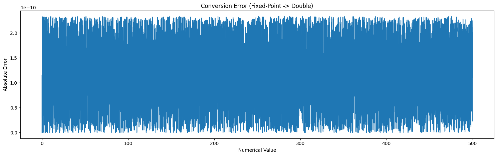  
This just shows the minimum error of the benchmarking proces caused by type conversion (and the floating point precision itself).  
As you can see it's about 10⁻¹⁰, which is very little.

### Multiplication
Here, results for 128-Bit and 64-Bit are exactly the same. Look [128-Bit](#128bit-enabled-fp64_mul) and [64-Bit](#default-fp64_mul) to see the difference (or lack of) in instructions used

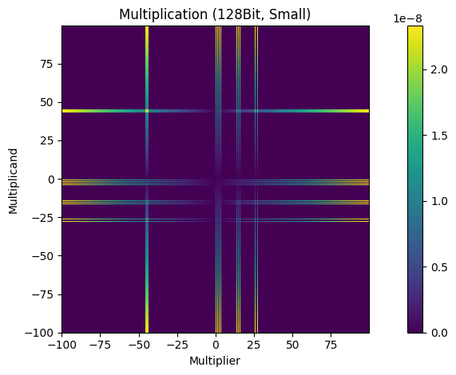
> Log values scale

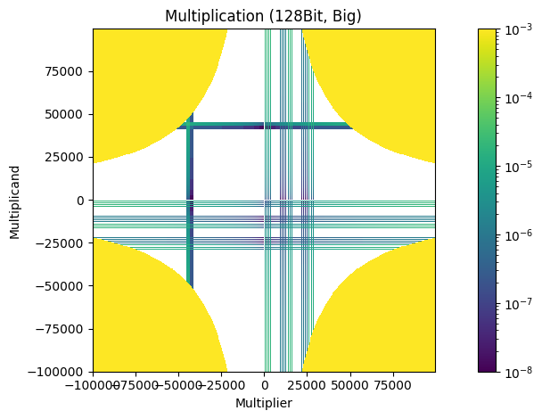  
**White on this graph represents 0, and yellow parts are simply caused by an overflow (>2³¹)*

To no one's surprise error here is negligible.

### Division
> Log values scale

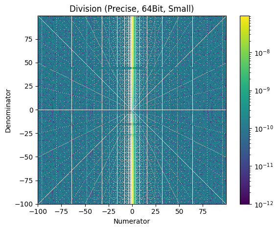

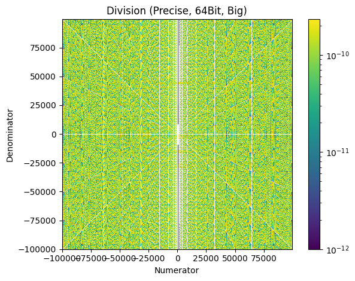
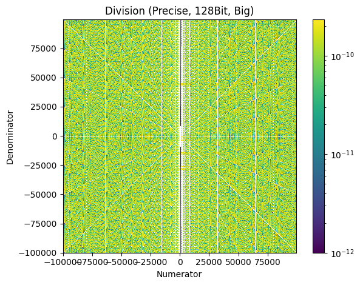

Again, the difference in precision is non-existent. That's why it's strongly advised to use the 128-Bit data types.

Just for fun I decided to see the default FP64_Div (not precise) version on big scale:
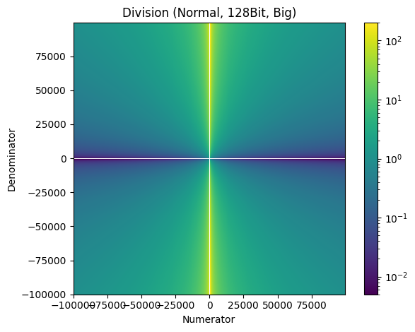

The error here is huge compared to the precise version. And it looks way nicer.

### Exponent
> Log X and Y scale

Exp starts returning gibberish at about ln(2^31) (~21.487), as this is the integer limit for the 64bit Fixed point (Q32.32).

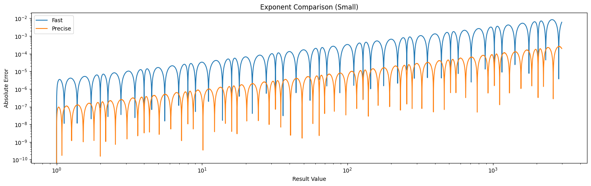
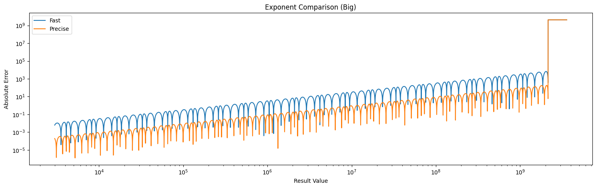

I think that for smaller values it's sensible to use the `ExpFast`, while it might be more beneficial to use the `ExpPrecise` when higher level of precision is required.

### Square Root
> Log Y scale

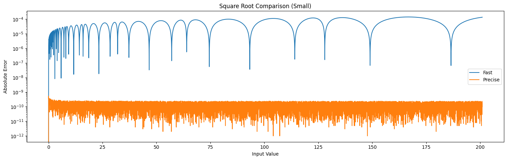
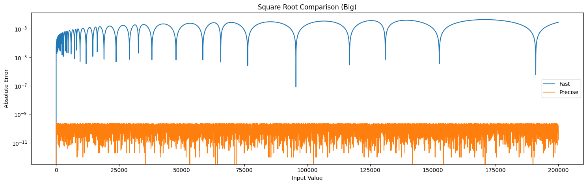

Here we can again see the wavy pattern, but the overall precision of the Fast version is pretty good.
I'd even say it's just enough for what's required, as we only deal with rather small input values of sqrt, where the precision is even better.
This function is called every `irq`, so keeping it fast is crucial. This amount of precision is acceptable for our purpose.

### Pow

**Small**

> Log Values scale

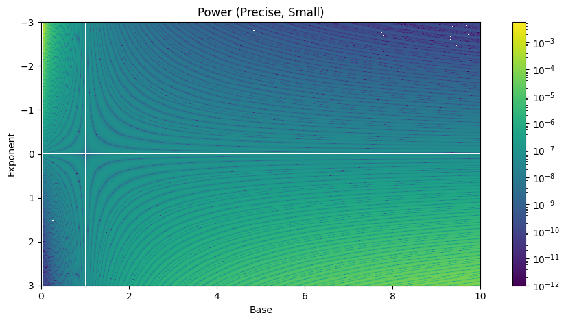
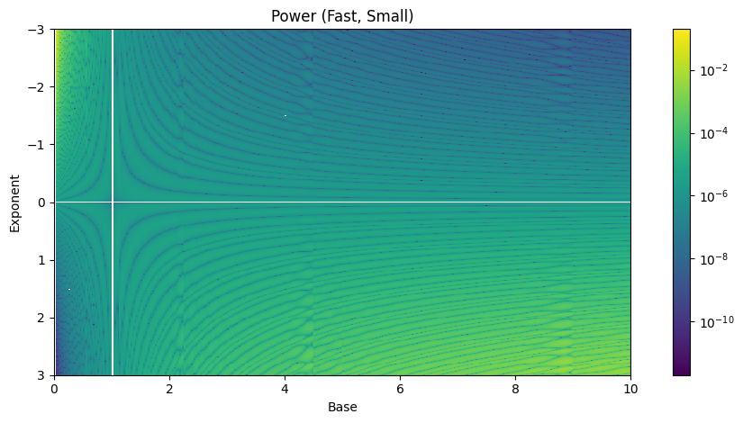  
But as you can see. The absolute error for relatively small values is also relatively small, no matter the version (`Fast` or `Precise`).

**Big**

> Log Values scale

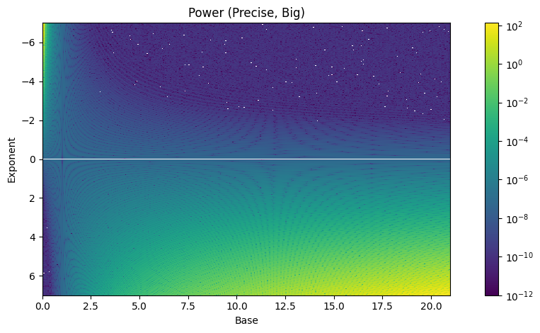


For this test (like for many others) it would be nice to have a relative error, but I decided to keep everything the same, so not to introduce any unnecessary confusion.  
I think it is pretty safe to say that the precision of the `Fast` version is enough.

### Log
> Log Y scale

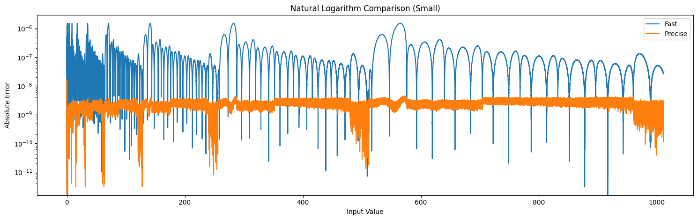
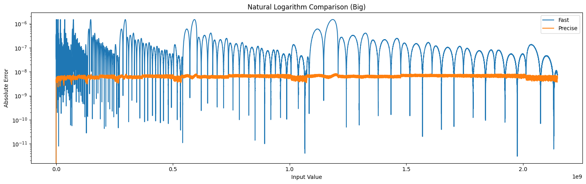

The precision of both `Fast`, and `Precise` functions is very good. Thus, I will stick with the `Fast` version.


# Real-Life Performance Gains
All the above comes down to this:

|                        | Fixed Precise | Floating (float) | Fixed Fast* |
|:----------------------:|:-------------:|:----------------:|:-----------:|
| **Avg. IRQ time [ns]** |   346.7052    |     343.2419     |  190.4042   |

*(The tests were conducted using `Jump` with smoothing on, as it's the most calculation heavy setting)*

I'm quite happy with this performance, as the `Precise` version is surely much more precise than `float`, and the `Fast` version
is precise enough not to notice a difference while giving a significant performance boost (*about 1.5x in most cases*).  
By default the program will now run at the `Fixed Fast` setting.

**"Fixed Fast" is one level faster than the most precise version, so if a function has a `Precise` version like `FP64_SqrtPrecise()`, then 
`FP64_Sqrt()` is used as the `Fast` version. It also implements all the optimizations I managed to come up with.*


*If you would only look at the images, this page would look like a failed modern art project...*